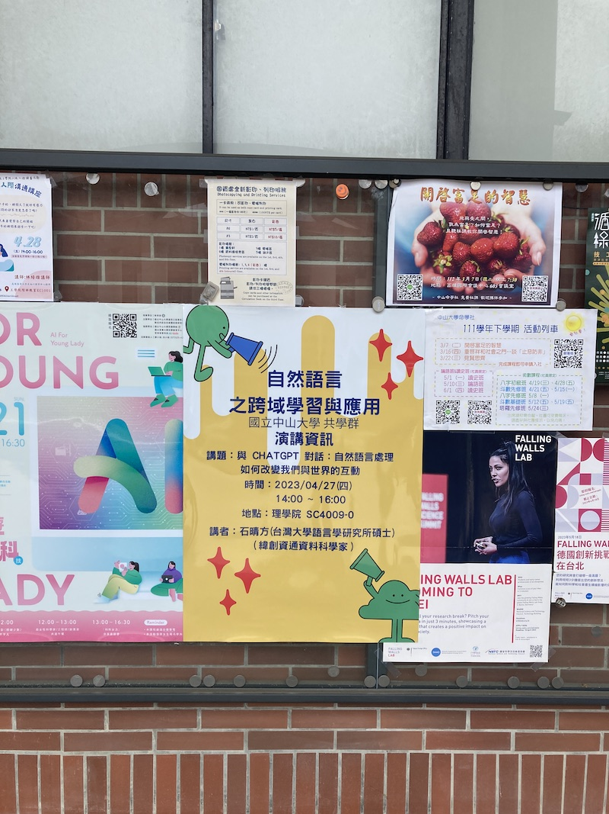
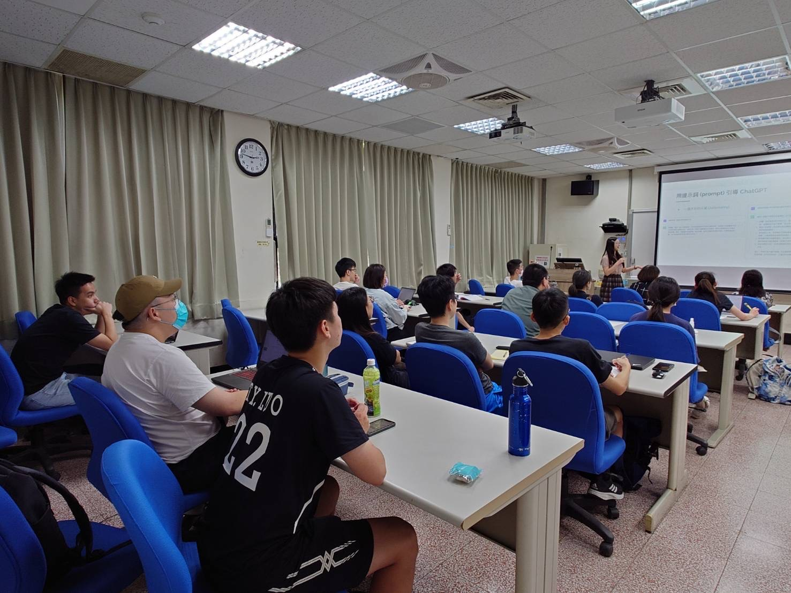

上週四 (2023/04/27) 很榮幸得到中山大學應數系林晉宏副教授，以及外文系徐淑瑛教授的邀請，回到母校演講。選定這個主題，除了跟上最近火紅的話題，也希望透過與聽眾的互動，了解不同領域的老師和學生們如何使用 ChatGPT。近期相關發展非常快速，工具更是如雨後春筍般出現，本次演講未能涵蓋全部主題，但希望向大家介紹自然語言處理、ChatGPT 模型訓練原理，以及實用的 prompting 和 API 使用範例。

這次演講感謝中山共學群的老師們：應數系林晉宏老師、翁鵬絜老師，外文系徐淑瑛老師、歐淑珍老師、黃舒屏老師的支持，讓我有機會完成一個值得紀念的里程碑。也感謝班導李祁芳老師特地來參加我的演講，看到老師在台下就很安心！由衷感謝碩班指導老師 - 謝舒凱老師幫我 review 投影片，並提供我演講聚焦的方向。

感謝來參與的同學們，在 QA 時間同學們的發問及討論讓我獲得很多啟發。像是大型語言模型的訓練方式、著作權問題，甚至是計算語言學的未來等，都讓我重新思考了 ChatGPT 帶來的影響。除此之外，同學們也發問了和語言所、資料科學、及未來求職相關的問題，也有同學和我分享他們的跨域經驗，不論是自學或參加專題都非常厲害。也很開心本次演講獲得深入淺出、生動有趣且實用的回饋！

📄 演講投影片：[bit.ly/20230427_nsysu_nlp](https://bit.ly/20230427_nsysu_nlp)

<!-- 

 -->



Photo by <a href="https://unsplash.com/ko/@teapowered?utm_source=unsplash&utm_medium=referral&utm_content=creditCopyText">Patrick Robert Doyle</a> on <a href="https://unsplash.com/photos/yUvZYHV2Zbw?utm_source=unsplash&utm_medium=referral&utm_content=creditCopyText">Unsplash</a>